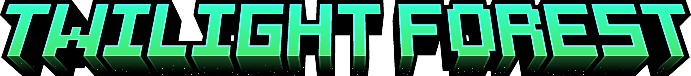

---

## Licensing

- All code is released under the **GNU GPL v2.1** license [HERE](LICENSE).
- All non-code assets are licensed under **CC BY-NC-SA 4.0 International** [HERE](repo/LICENSE.assets).

See the `LICENSE` file(s) for full details.

---

## Acknowledgements

Credit for the original mod and assets goes to:

- [TeamTwilight](https://github.com/TeamTwilight)
- [Benimatic](https://github.com/Benimatic)

Be sure to check out their project for NeoForge releases.

---

## Current Supported Version

- `26.1-snapshot-11`

---

## Planned Features

While the goal is not exact parity with the original mod, most relevant features are planned to be replicated in some form.

To view the progress of indivudal features, check [HERE](repo/TODO.md)

---

## 📦 Downloads

Once version **1.0.0** becomes available, builds will be published on:

- [Modrinth](https://modrinth.com/)

Until then:
- Testing builds may be released via GitHub.
- The project can be built manually from source.

---

## 📫 Contact Info

- Email: `shinigami7x@proton.me`
- Discord: `chronictsuki`  
  *(Discord may not be checked frequently.)*

